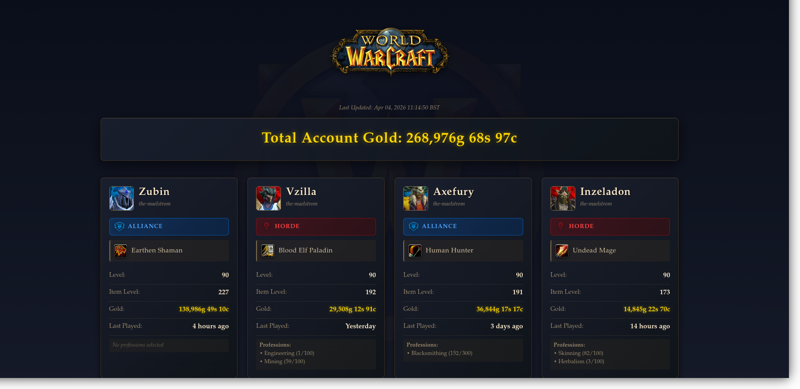

# WoW Character Stats Tracker

A self-hosted World of Warcraft character dashboard that uses the official Battle.net API to display stats across all characters on your account.



## Features

- 🏆 **All Characters** — Automatically discovers every character on your account
- 💰 **Gold Tracking** — Per-character gold and total account gold
- ⚔️ **Level & Item Level** — Sorted by level and item level (descending)
- 🛡️ **Faction** — Alliance/Horde display with logos
- 🧙 **Race & Class** — With class icons
- 🖼️ **Character Portraits** — Pulls avatars from the Blizzard media API
- 🕐 **Last Played** — Human-readable "last seen" timestamps
- 🔨 **Professions** — Primary professions with skill level
- 🌍 **Multi-region** — Supports US, EU, KR, TW regions

## Prerequisites

- [Go 1.22+](https://golang.org/dl/) **or** [Docker](https://docs.docker.com/get-docker/)
- A [Battle.net Developer Account](https://develop.battle.net/)

---

## Step 1 — Create a Battle.net API Client

1. Go to [https://develop.battle.net/access/](https://develop.battle.net/access/) and log in with your Battle.net account
2. Click **Create Client**
3. Fill in the details:
   - **Client Name**: anything you like (e.g. `WoW Stats Tracker`)
   - **Redirect URLs**: `http://localhost:8081/callback`
   - **Service URL**: `http://localhost:8081`
4. Click **Save** — you will be given a **Client ID** and **Client Secret**

> ⚠️ Keep your Client Secret private — never commit it to a public repository.

---

## Step 2 — Configure the Application

Copy the example environment file and fill in your credentials:

```bash
cp .env.example .env
```

Edit `.env`:

```env
BLIZZARD_CLIENT_ID=your_client_id_here
BLIZZARD_CLIENT_SECRET=your_client_secret_here

REGION=eu        # us, eu, kr, tw
LOCALE=en_GB     # en_US, en_GB, de_DE, fr_FR, es_ES, etc.
PORT=8081
```

---

## Step 3 — Run the Application

### Option A: Go (local)

```bash
go run main.go
```

### Option B: Docker Compose

```bash
docker-compose up --build
```

Then open [http://localhost:8081](http://localhost:8081) in your browser and click **Login with Battle.net**.

---

## How It Works

1. You click **Login with Battle.net** — you are redirected to Blizzard's OAuth page
2. After authorising, the app fetches all characters on your account automatically
3. For each character it calls multiple API endpoints in parallel:
   - Public profile (level, item level, race, class, faction, last login, professions)
   - Media API (character portrait/avatar)
   - Protected character endpoint (gold — requires OAuth)
4. Results are displayed sorted by level, then item level

---

## Security Notes

- Your `.env` file is listed in `.gitignore` and will **never** be committed
- Credentials are loaded from environment variables only — nothing is hardcoded
- The OAuth token is held in memory only and is not persisted to disk
- No database or external storage is used

---

## Region & Locale Reference

| Region   | Code | Example Locales                          |
|----------|------|------------------------------------------|
| Europe   | `eu` | `en_GB`, `de_DE`, `fr_FR`, `es_ES`, `ru_RU` |
| Americas | `us` | `en_US`, `es_MX`, `pt_BR`               |
| Korea    | `kr` | `ko_KR`                                  |
| Taiwan   | `tw` | `zh_TW`                                  |

---

## Troubleshooting

**"BLIZZARD_CLIENT_ID and BLIZZARD_CLIENT_SECRET are required"**
→ Make sure your `.env` file exists and has your credentials filled in.

**Characters not showing after login**
→ The app fetches data in the background after OAuth. Wait a few seconds — the page will refresh automatically.

**404 errors for some characters in logs**
→ These are deleted or renamed characters still listed in your account. This is normal and they are skipped automatically.

**OAuth redirect error**
→ Make sure `http://localhost:8081/callback` is listed exactly as a Redirect URL in your Battle.net developer portal client settings.
